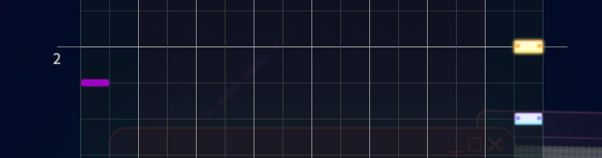

# Adding Skill & Fever events

## About Skill & Fever events (procs)

In MMW, importing official charts will show you extra things that you cannot add the normal way.

| Events (procs)                                                                                           | Description                                                                                          |
| -------------------------------------------------------------------------------------------------------- | ---------------------------------------------------------------------------------------------------- |
| <div><figure><figcaption></figcaption></figure></div> | `SKILL`: Trigger one of your skill cards. Shown as the blue "Skill" tag                              |
| <div><figure><figcaption></figcaption></figure></div> | `FEVER CHANCE`: Trigger building FEVER bar (multi-live only). Shown as the orange FEVER up arrow tag |
| <div><figure><figcaption></figcaption></figure></div> | `FEVER START`: Trigger FEVER activation (multi-live only). Shown as the orange FEVER down arrow tag  |

## How to Add?

1. Go to your **project file** (`.mmws/.ccmmws`) in [MMW4CC](../getting-started/usage-guide-mmw4cc.md) and add the proc based on this

```
SKILL: damage note on the 2nd extended lane (left)
FEVER CHANCE: tap note on the 2nd extended lane (right)
FEVER START: critical tap note on the 2nd extended lane (right)
```


**You can only add 6 `SKILL` procs, 1 `FEVER CHANCE` & 1 `FEVER START`** per chart.


<figure><figcaption></figcaption></figure>

2. Delete everything except the proc **(DO NOT SAVE `Ctrl+S`)** and export it as `.sus` via [keyboard shortcut](adding-skill-and-fever-events.md#shortcut-configuration-key-config) (by default it's `Ctrl+E`). You can name it `skillfever.sus` or something else.
3. Open the file and scroll down, you'll see the text that look like this:

```
#HISPEED 00
#00710:41
#HISPEED 00
#02310:41
#HISPEED 00
#03610:0041
#HISPEED 00
#05010:0041
#HISPEED 00
#0631f:0011
#HISPEED 00
#06510:0041
#HISPEED 00
#0751f:0021
#HISPEED 00
#08310:41
```

4. Delete the `#HISPEED 00` line. you'll get:

```
#00710:41
#02310:41
#03610:0041
#05010:0041
#0631f:0011
#06510:0041
#0751f:0021
#08310:41
```

5. Copy that text and paste it **anywhere after `#MEASUREHS 00`** into your main `.sus` file.

```
#REQUEST "ticks_per_beat 480"

#00002:4

#BPM01:164
#BPM02:20.5
#BPM03:102.5

#TIL00: "0.0:1"
#HISPEED 00
#MEASUREHS 00

[INSERT SKILL & FEVER PROC BELOW] # don't add comments in your file, i don't know why people added it
#00710:41
#02310:41
#03610:0041
#05010:0041
#0631f:0011
#06510:0041
#0751f:0021
#08310:41

[The rest of this are the charting part.]
#00008:01
#03008:0200000300000000
.....
```

6. Check by opening your main `.sus` file in MMW. If done correctly, you'll be able to see the procs below!

<figure><figcaption></figcaption></figure>
